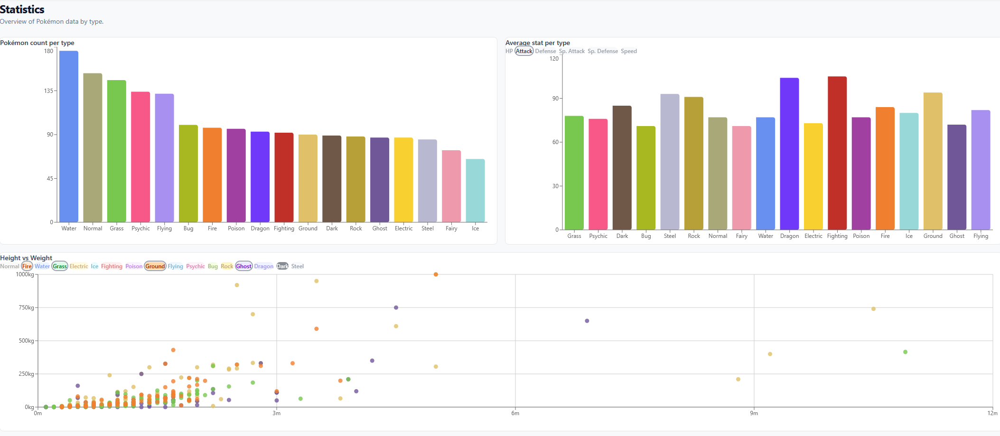
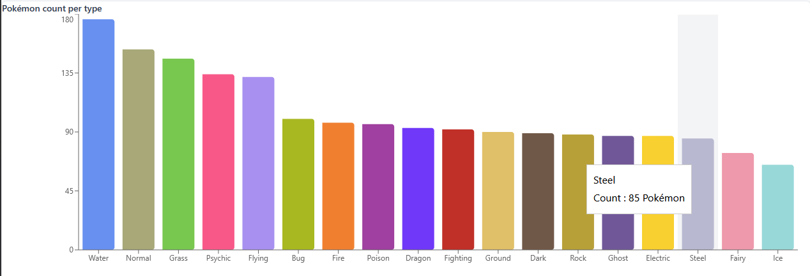
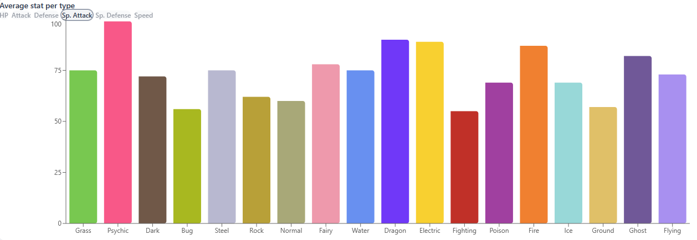
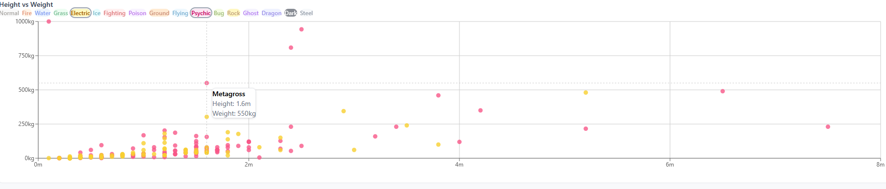

# Assignment WT - Web for Data Science


# PokeBase

> A data visualization dashboard for Pokémon, built for anyone who wants to explore the numbers behind their favourite Pokémon.

## Deployed Application

> URL: *placeholcer*

---

## Overview

PokeBase is an interactive web application that visualizes Pokémon data fetched from a custom-built GraphQL API. The app allows users to browse, search, and filter all Pokémon, compare stats, and explore statistical insights through interactive charts — all behind a secure OAuth 2.0 authentication flow.

The dataset covers all mainline Pokémon with attributes including base stats (HP, Attack, Defense, Sp. Attack, Sp. Defense, Speed), types, height, and weight. The application provides insights such as type distributions, stat comparisons, and height/weight correlations across the entire Pokédex.

## How to Use

*Explain how to interact with your visualization (controls, filters, etc.). Screenshots/gifs are encouraged.*



Overview of the Statistics Page


This Bar Chart shows all pokemon and their types and sorts them in order of how many pokemon belongs to each type. A hover effect exists that shiws the number of pokemon belonging to that type.


This Bar Chart shows the average stats for each type and allows the user to change what type to display via the buttons. Hover over a certain bar to see the average for that type.


The Scatter Chart shows the height and weight of each pokemon and allows the user to choose hich types they want to display and compare at the same time.


---

## Features

- **Pokédex browser** — Browse all Pokémon with pagination, search by name, and filter by type
- **Stat sorting** — Sort Pokémon by any base stat or total across the entire Pokédex
- **Shiny toggle** — Switch between normal and shiny sprites
- **Team builder** — Create and manage Pokémon teams of up to 6 members
- **Statistics dashboard** — Interactive charts including:
  - Bar chart: Pokémon count per type
  - Bar chart: Average stats per type
  - Scatter plot: Height vs Weight per type (with hover tooltips)
- **OAuth 2.0 authentication** — Secure login via GitHub
- **Protected routes** — All data pages require authentication

---

## Tech Stack

| Layer | Technology |
|---|---|
| Frontend | React 18, TypeScript, Vite |
| Styling | Tailwind CSS |
| Charts | Recharts |
| Routing | React Router v6 |
| Auth | GitHub OAuth 2.0 |
| Auth server | Node.js, Express |
| API | GraphQL (custom-built) |
| API | PokemonAPI (for images) |

---

## Architecture

The application consists of three parts:

```
┌─────────────────┐     ┌─────────────────┐     ┌─────────────────┐
│   React App     │────▶│  Express Server │────▶│  GraphQL API    │
│  (Vite + TS)    │     │  (OAuth handler)│     │  (PostgreSQL)   │
│  port 5173      │     │  port 3001      │     │  Railway        │
└─────────────────┘     └─────────────────┘     └─────────────────┘
```

The Express server handles the OAuth 2.0 authorization code exchange server-side, ensuring the GitHub client secret is never exposed to the browser. After authentication, the user's identity is mapped to the GraphQL API via register/login mutations, and a JWT is returned to the React app for all subsequent requests.

---

## Authentication Flow

1. User clicks **Sign in with GitHub**
2. Redirected to GitHub consent screen
3. GitHub sends authorization code to Express server
4. Express exchanges code for user email (server-side)
5. Express calls GraphQL API to register or log in the user
6. GraphQL API returns a JWT
7. JWT is stored and used for all protected API requests

---

## Getting Started

### Prerequisites

- Node.js 18+
- npm

### Installation

**1. Clone the repository**
```bash
git clone <your-repo-url>
cd assignment-wt
```

**2. Install frontend dependencies**
```bash
npm install
```

**3. Install server dependencies**
```bash
cd server
npm install
cd ..
```

**4. Set up environment variables**

Create `.env` in the root:
```
VITE_API_URL=your_graphql_api_url
VITE_AUTH_URL=http://localhost:3001
```

Create `server/.env`:
```
GITHUB_CLIENT_ID=your_github_client_id
GITHUB_CLIENT_SECRET=your_github_client_secret
API_URL=your_graphql_api_url
FRONTEND_URL=http://localhost:5173
OAUTH_SECRET=your_oauth_secret
```

**5. Run the application**

In one terminal, start the auth server:
```bash
cd server
node index.js
```

In another terminal, start the React app:
```bash
npm run dev
```

Visit `http://localhost:5173`

---

## Project Structure

```
assignment-wt/
├── src/
│   ├── components/       # Reusable UI components (Navbar, PokemonCard, ProtectedRoute)
│   ├── context/          # React context (AuthContext)
│   ├── hooks/            # Custom hooks (usePokemon, useTeams, useStatistics)
│   ├── pages/            # Page components (PokemonPage, StatisticsPage, TeamsPage)
│   ├── types/            # TypeScript types and type color maps
│   └── utils/            # GraphQL request utility
├── server/
│   └── index.js          # Express OAuth server
└── README.md
```

---

## Environment Variables

### Frontend (`.env`)

| Variable | Description |
|---|---|
| `VITE_API_URL` | GraphQL API endpoint |
| `VITE_AUTH_URL` | Express auth server URL |

### Server (`server/.env`)

| Variable | Description |
|---|---|
| `GITHUB_CLIENT_ID` | GitHub OAuth App client ID |
| `GITHUB_CLIENT_SECRET` | GitHub OAuth App client secret |
| `API_URL` | GraphQL API base URL |
| `FRONTEND_URL` | React app URL (for redirects) |
| `OAUTH_SECRET` | Password used for OAuth-mapped accounts |

---


## Acknowledgements

*Resources, attributions, or shoutouts.*


## Requirements

See [all requirements in Issues](../../issues/). Close issues as you implement them. Create additional issues for any custom functionality.

### Functional Requirements

| Requirement | Issue | Status |
|---|---|---|
| API Integration — the app consumes your WT1 API | [#14](../../issues/14) | :white_large_square: |
| OAuth Authentication — users log in via OAuth 2.0 | [#15](../../issues/15) | :white_large_square: |
| Interactive data visualization with aggregation/adaptation for 10 000+ data points | [#11](../../issues/11) | :white_large_square: |
| Efficient loading — pagination, lazy loading, loading indicators | [#13](../../issues/13) | :white_large_square: |

### Non-Functional Requirements

| Requirement | Issue | Status |
|---|---|---|
| Clear and well-structured code | [#1](../../issues/1) | :white_large_square: |
| Code reuse | [#2](../../issues/2) | :white_large_square: |
| Dependency management and scripts | [#3](../../issues/3) | :white_large_square: |
| Source code documentation | [#4](../../issues/4) | :white_large_square: |
| Coding standard | [#5](../../issues/5) | :white_large_square: |
| Examiner can follow the creation process | [#6](../../issues/6) | :white_large_square: |
| Publicly accessible over the internet | [#7](../../issues/7) | :white_large_square: |
| Keys and tokens handled correctly | [#8](../../issues/8) | :white_large_square: |
| Complete assignment report with correct links | [#9](../../issues/9) | :white_large_square: |

### VG — AI/ML Feature (optional)

For a VG grade, integrate **one** AI/ML feature into the application. Pick one below or propose your own of similar scope. See the [VG issue](../../issues/12) for full details and acceptance criteria.

| Option | Status |
|---|---|
| Semantic Search — natural language queries matched by meaning | :white_large_square: |
| Content-Based Recommendations — "items similar to this one" | :white_large_square: |
| Sentiment Analysis — analyze and visualize text sentiment | :white_large_square: |
| Text Summarization / Generation — LLM-powered summaries | :white_large_square: |
| Clustering & Grouping — auto-group similar items visually | :white_large_square: |
| RAG — natural language Q&A grounded in your dataset | :white_large_square: |
| Other: *describe* | :white_large_square: |

*Describe your chosen AI/ML feature and how it integrates with your application:*


## Author

**Isak Thörnqvist**  
Linnaeus University — 1DV027