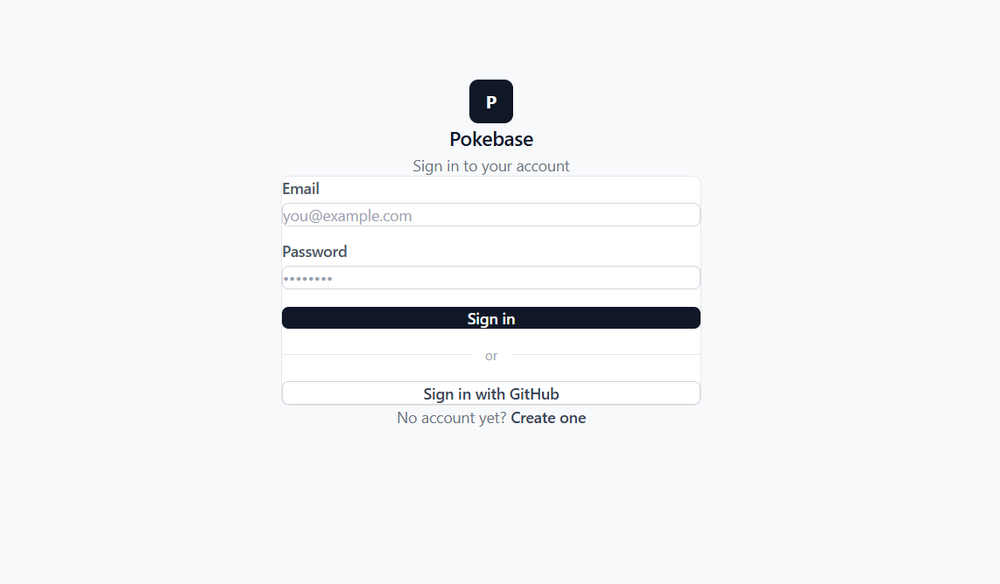
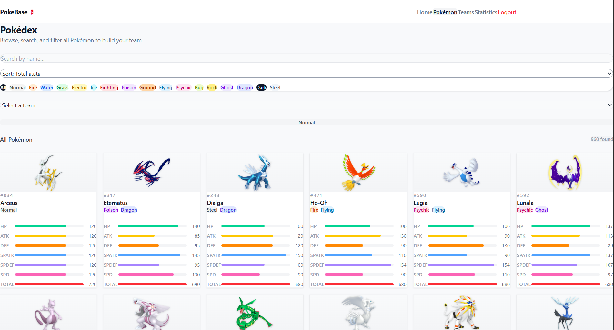
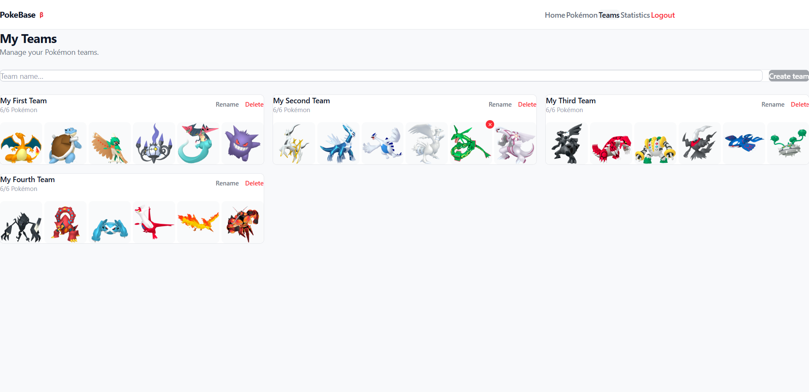

# Assignment WT - Web for Data Science


# PokeBase

> An interactive Pokémon data dashboard — explore, compare, and visualize stats across the entire Pokédex.


## Deployed Application

> URL: https://pokebase-production-8b7e.up.railway.app/

---

## Overview

PokeBase is a data visualization web application built with React and TypeScript, powered by a custom build api found at: https://github.com/IsakThornqvist/1dv027-Assignment-API-design. Authenticated users can browse the entire Pokédex, build teams, and explore statistical insights through interactive charts.

The dataset covers all mainline Pokémon and includes:
- **Base stats** — HP, Attack, Defense, Sp. Attack, Sp. Defense, Speed
- **Physical attributes** — height and weight
- **Typing** — primary and secondary types

The statistics dashboard provides insights such as type distributions, per-type stat averages, and height/weight correlations — aggregated across the full Pokédex.

## How to Use

### Pokédex Browser
The Pokémon page is the core of the application. It allows authenticated users to browse the entire Pokédex with the following controls:

- **Search** — type in the search bar to find a Pokémon by name
- **Type filter** — click any type pill to filter Pokémon by that type
- **Stat sorting** — use the sort dropdown to rank all Pokémon by a specific stat or total base stats
- **Shiny toggle** — switch between normal and shiny sprites

### Building a Team
1. Select a team from the **Select a team** dropdown (requires at least one created team)
2. A **+** button appears on each Pokémon card
3. Click **+** to add that Pokémon to the selected team
4. Teams are capped at **6 Pokémon** maximum

### Teams Page
Manage your teams from the Teams page:
- **Create** a new team by typing a name and clicking Create team
- **Rename** a team by clicking Rename
- **Remove** a Pokémon from a team by hovering over its slot and clicking the red × button
- **Delete** an entire team by clicking Delete

### Statistics Page
Explore data insights through three interactive charts:
- **Pokémon count per type** — hover over a bar to see the exact count
- **Average stats per type** — click a stat button to switch which stat is displayed
- **Height vs Weight scatter plot** — click type pills to add or remove types from the chart, hover over a dot to see the Pokémon's name, height and weight


- Overview of the Statistics Page


- Overview of login page


- The Pokédex browser showing Pokémon sorted by total base stats. 
- The type filter pills and sort dropdown are visible in the toolbar. 
- A team is not currently selected on this picture


- The Teams Page shows all the teams of the logged in user
- Allows creation of new teams
- Ability to delete entire teams
- Ability to remove a pokemon from a team
- Ability to rename a team


- Pokémon count per type sorted in descending order
- Water type has the most Pokémon, Flying the fewest
- Hover over a bar to see the exact count for that type


- Average base stats per type, currently showing Attack
- Click any stat button above the chart to switch between HP, Attack, Defense, Sp. Attack, Sp. Defense and Speed
- Hover over a bar to see the exact average for that type


- Height (m) on the X-axis, Weight (kg) on the Y-axis
- Multiple types can be selected and compared simultaneously by clicking the type pills
- Hover over any dot to see the Pokémon's name, height and weight


---

## Features

- **Pokédex browser** — Browse all Pokémon with pagination, search by name, and filter by type
- **Stat sorting** — Sort Pokémon by any base stat or total across the entire Pokédex
- **Shiny toggle** — Switch between normal and shiny sprites
- **Team builder** — Create and manage Pokémon teams of up to 6 members
- **Statistics dashboard** — Interactive charts including:
  - Bar chart: Pokémon count per type
  - Bar chart: Average stats per type
  - Scatter plot: Height vs Weight per type (with hover tooltips)
- **OAuth 2.0 authentication** — Secure login via GitHub
- **Protected routes** — All data pages require authentication

---

## Tech Stack

| Layer | Technology |
|---|---|
| Frontend | React 18, TypeScript, Vite |
| Styling | Tailwind CSS |
| Charts | Recharts |
| Routing | React Router v6 |
| Auth | GitHub OAuth 2.0 |
| Auth server | Node.js, Express |
| API | GraphQL (custom-built) |
| API | PokemonAPI (for images) |

---

## Architecture

The application consists of three parts:

```
┌─────────────────┐     ┌─────────────────┐     ┌─────────────────┐
│   React App     │────▶│  Express Server │────▶│  GraphQL API    │
│  (Vite + TS)    │     │  (OAuth handler)│     │  (PostgreSQL)   │
│  port 5173      │     │  port 3001      │     │  Railway        │
└─────────────────┘     └─────────────────┘     └─────────────────┘
```

> Note: Ports above reflect local development. In production, all services are deployed on Railway.

The Express server handles the OAuth 2.0 authorization code exchange server-side, ensuring the GitHub client secret is never exposed to the browser. After authentication, the user's identity is mapped to the GraphQL API via register/login mutations, and a JWT is returned to the React app for all subsequent requests.

---

## Authentication Flow

1. User clicks **Sign in with GitHub**
2. Redirected to GitHub consent screen
3. GitHub sends authorization code to Express server
4. Express exchanges code for user email (server-side)
5. Express calls GraphQL API to register or log in the user
6. GraphQL API returns a JWT
7. JWT is stored and used for all protected API requests

---

## Getting Started

### Prerequisites

- Node.js 18+
- npm

### Installation

**1. Clone the repository**
```bash
git clone https://github.com/IsakThornqvist/Pokebase.git
cd assignment-wt
```

**2. Install frontend dependencies**
```bash
npm install
```

**3. Install server dependencies**
```bash
cd server
npm install
cd ..
```

**4. Set up environment variables**

Create `.env` in the root:
```
VITE_API_URL=your_graphql_api_url
VITE_AUTH_URL=http://localhost:3001
```

Create `server/.env`:
```
GITHUB_CLIENT_ID=your_github_client_id
GITHUB_CLIENT_SECRET=your_github_client_secret
API_URL=your_graphql_api_url
FRONTEND_URL=http://localhost:5173
OAUTH_SECRET=your_oauth_secret
```

**5. Run the application**

In one terminal, start the auth server:
```bash
cd server
node index.js
```

In another terminal, start the React app:
```bash
npm run dev
```

Visit `http://localhost:5173`

---

## Project Structure

```
assignment-wt/
├── src/
│   ├── components/       # Reusable UI components (Navbar, PokemonCard, ProtectedRoute)
│   ├── context/          # React context (AuthContext)
│   ├── hooks/            # Custom hooks (usePokemon, useTeams, useStatistics)
│   ├── pages/            # Page components (PokemonPage, StatisticsPage, TeamsPage)
│   ├── types/            # TypeScript types and type color maps
│   └── utils/            # GraphQL request utility
├── server/
│   └── index.js          # Express OAuth server
└── README.md
```

---

## Environment Variables

### Frontend (`.env`)

| Variable | Description |
|---|---|
| `VITE_API_URL` | GraphQL API endpoint |
| `VITE_AUTH_URL` | Express auth server URL |

### Server (`server/.env`)

| Variable | Description |
|---|---|
| `GITHUB_CLIENT_ID` | GitHub OAuth App client ID |
| `GITHUB_CLIENT_SECRET` | GitHub OAuth App client secret |
| `API_URL` | GraphQL API base URL |
| `FRONTEND_URL` | React app URL (for redirects) |
| `OAUTH_SECRET` | Password used for OAuth-mapped accounts |

---


## Acknowledgements

- [PokemonDB](https://pokemondb.net/) — Pokémon sprites used for card and team slot images
- [PokeBase API](https://github.com/IsakThornqvist/1dv027-Assignment-API-design) — custom-built GraphQL API powering all Pokémon and team data
- [Recharts](https://recharts.org/) — charting library used for all data visualizations
- [Tailwind CSS](https://tailwindcss.com/) — utility-first CSS framework used for all styling
- [Apollo Server](https://www.apollographql.com/docs/apollo-server/) — GraphQL server used in the API
- [Prisma](https://www.prisma.io/) — ORM used for database access in the API
- [GitHub OAuth](https://docs.github.com/en/apps/oauth-apps) — third-party OAuth 2.0 provider used for authentication
- [Railway](https://railway.app/) — platform used to host the GraphQL API and PostgreSQL database


## Requirements


### Functional Requirements

| Requirement | Issue | Status |
|---|---|---|
| API Integration — the app consumes your WT1 API | [#14](../../issues/14) | :white_check_mark: |
| OAuth Authentication — users log in via OAuth 2.0 | [#15](../../issues/15) | :white_check_mark: |
| Interactive data visualization with aggregation/adaptation for 10 000+ data points | [#11](../../issues/11) | :white_check_mark: |
| Efficient loading — pagination, lazy loading, loading indicators | [#13](../../issues/13) | :white_check_mark: |

### Non-Functional Requirements

| Requirement | Issue | Status |
|---|---|---|
| Clear and well-structured code | [#1](../../issues/1) | :white_check_mark: |
| Code reuse | [#2](../../issues/2) | :white_check_mark: |
| Dependency management and scripts | [#3](../../issues/3) | :white_check_mark: |
| Source code documentation | [#4](../../issues/4) | :white_check_mark: |
| Coding standard | [#5](../../issues/5) | :white_check_mark: |
| Examiner can follow the creation process | [#6](../../issues/6) | :white_check_mark: |
| Publicly accessible over the internet | [#7](../../issues/7) | :white_check_mark: |
| Keys and tokens handled correctly | [#8](../../issues/8) | :white_check_mark: |
| Complete assignment report with correct links | [#9](../../issues/9) | :white_check_mark: |


## Author

**Isak Thörnqvist**  
Linnaeus University — 1DV027